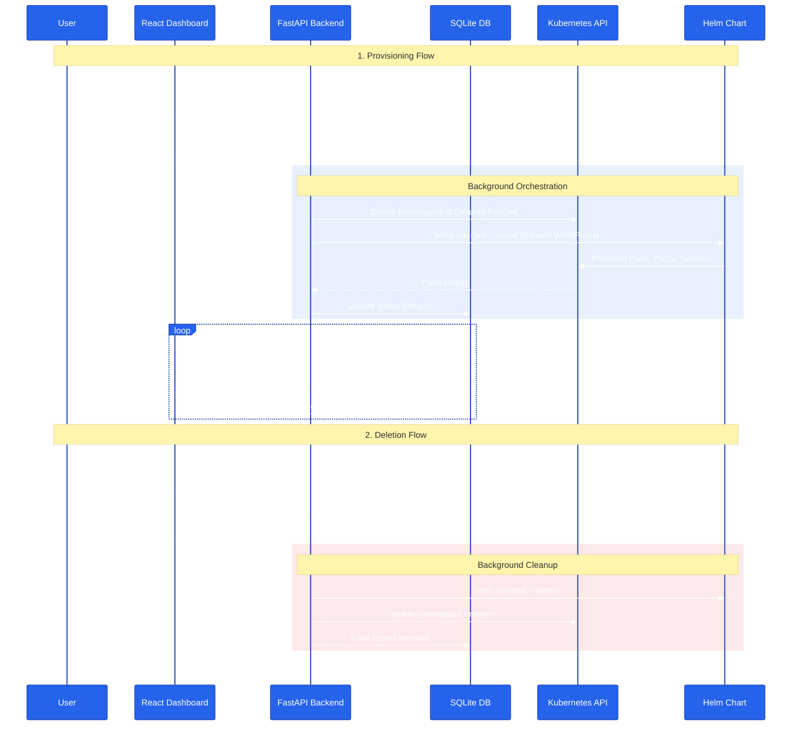

# Kubernetes Store Orchestrator

A platform that provisions fully functional, isolated WooCommerce stores on Kubernetes with one click. Each store gets its own namespace, database, persistent storage, and network isolation.

> **📹 Demo Video:** [Watch the full walkthrough here](#)
>
> **✅ Live Deployment:** **Deployed on **AWS EC2 (m7i-flex.large)** with k3s**

## System Architecture & Lifecycle

The platform follows an **asynchronous orchestrator** pattern. This allows the API to remain responsive while complex Kubernetes operations (which can take 30-60s) run in the background.



### Core Components

- **Frontend**: React — Real-time dashboard with **live polling** (3s interval), **resource quota visualization** per store, and **failure-cause analysis** (detects ImagePullBackOff, CrashLoopBackOff, Quota Exceeded).
- **Backend**: Python + FastAPI + SQLAlchemy (SQLite) — Async API with background task provisioning, structured logging, and **Persistent Audit Logs**
- **Orchestration**: Helm charts + kubectl via subprocess — Wraps Bitnami's production-grade WordPress chart with custom values.
- **Infra**: Namespace-per-store with ResourceQuota, NetworkPolicy, LimitRange, RBAC (least-privilege), and HPA — **Triple-Layered Security**

## Project Structure

The codebase is split into three independent layers — frontend, backend, and infrastructure — so each can be developed, tested, and deployed independently.

```
├── backend/              # FastAPI orchestrator
│   ├── main.py           # API endpoints + background tasks
│   ├── k8s_service.py    # Helm/kubectl wrapper functions
│   ├── models.py         # SQLAlchemy store model
│   ├── schemas.py        # Pydantic validation (K8s-safe names)
│   └── database.py       # DB session management
├── frontend/             # React dashboard
│   └── src/components/
│       ├── StoreDashboard.jsx      # Store list + polling
│       ├── StoreCard.jsx           # Store card with live quota view
│       ├── CreateStoreModal.jsx    # Store creation form
│       └── InfrastructureMonitor.jsx # Live cluster health
└── infra/
    ├── helm/woocommerce/
    │   ├── Chart.yaml              # Bitnami WordPress dependency
    │   ├── values-local.yaml       # Local dev config (1Gi, low CPU)
    │   └── values-prod.yaml        # Production config (10Gi, TLS)
    └── k8s/templates/
        ├── resource_quota.yaml     # CPU/Memory/Pod caps per store
        ├── network_policy.yaml     # Deny-by-default isolation
        ├── limit_range.yaml        # Default container limits
        └── provisioner_rbac.yaml   # Least-privilege ServiceAccount
```

## Quick Start (TL;DR)

```bash
# 1. Start local cluster
k3d cluster create k8s-store --port "8080:80@loadbalancer"

# 2. Start backend (in one terminal)
cd backend && pip install -r requirements.txt && cp .env.example .env && uvicorn main:app --reload

# 3. Start frontend (in another terminal)
cd frontend && npm install && cp .env.example .env && npm run dev

# 4. Open http://localhost:5173 → Create Store → Wait for Ready → Place Order
```

## Local Setup

### Prerequisites

- Docker
- k3d
- kubectl & helm
- Python 3.9+
- Node.js 18+

### 1. Start a Cluster

```bash
k3d cluster create k8s-store --port "8080:80@loadbalancer"
```

### 2. Backend

```bash
cd backend
python -m venv venv && source venv/bin/activate
pip install -r requirements.txt
cp .env.example .env   # Set BASE_DOMAIN=127.0.0.1.nip.io
uvicorn main:app --reload
```

### 3. Frontend

```bash
cd frontend
npm install
cp .env.example .env   # Set VITE_API_URL=http://localhost:8000
npm run dev
```

Open `http://localhost:5173` to access the dashboard.

### Production Setup (VPS / AWS)

The same code runs in production — only the Helm values change. **Deployed and verified on AWS EC2 (m7i-flex.large, 2 vCPU / 8GB RAM)** running k3s — stores provisioned, orders placed, RBAC verified, HPA tested end-to-end.

1. **Fix Kubeconfig Permissions** (Crucial on AWS/k3s):

   ```bash
   mkdir -p ~/.kube
   sudo cp /etc/rancher/k3s/k3s.yaml ~/.kube/config
   sudo chown $(whoami) ~/.kube/config
   chmod 600 ~/.kube/config
   export KUBECONFIG=~/.kube/config
   ```

2. Set `ENV=production` and `BASE_DOMAIN=<your-ip>.nip.io` in `backend/.env`
3. Set the frontend API URL: `echo "VITE_API_URL=http://<your-ip>:8000" > frontend/.env`
4. The backend auto-selects `values-prod.yaml` instead of `values-local.yaml`
5. **Apply RBAC (Security Hardening):** Grant the backend "least-privilege" permissions to manage stores:

   ```bash
   kubectl apply -f infra/k8s/templates/provisioner_rbac.yaml
   ```

### How to Create a Store and Place an Order

1. Open the dashboard at `http://localhost:5173`
2. Click **Create Store** → type a valid name → select WooCommerce → Deploy
3. Watch the **Lifecycle Logs** and wait for status to change from **Provisioning** → **Ready**
4. Click the store URL to open the storefront
5. Add a product to cart → Checkout → select **Cash on Delivery** → Place Order
6. Open `/wp-admin` (credentials shown on the store card) → WooCommerce → Orders → verify the order

### Default Credentials

- **Username**: `admin`
- **Password**: Displayed on the store card (dynamically generated for security).
- **Admin URL**: `http://<store-name>.<domain>/wp-admin`

### API & Environment Configuration

- **Backend API URL**: Configurable via `frontend/.env` (e.g., `VITE_API_URL=http://localhost:8000`).
- **Store Domain**: Configurable via `backend/.env` (e.g., `BASE_DOMAIN=127.0.0.1.nip.io`).

## System Design & Tradeoffs

### Why I built it this way

Provisioning a store takes 30-60 seconds (WordPress + MariaDB + WooCommerce install). I can't make the user stare at a loading screen that long, so the API returns right away with `status: Provisioning` and the actual work runs in a background task. The frontend polls every few seconds to check if it's ready yet and user can see **Lifecycle Logs**

I went with FastAPI's `BackgroundTasks` instead of something like Celery because given the time constraint, setting up a Redis queue felt like overkill. The tradeoff is that if the backend process dies, in-flight provisions are lost — but for a complete production setup we can easily switch to Celery later.

The backend is fully stateless — all state lives in SQLite (store metadata) and Kubernetes (actual resources). This means the API can be horizontally scaled without any session affinity or shared memory.

For DNS, I chose **nip.io** — a free wildcard DNS service that maps any IP to a hostname automatically. For example, `store-demo.35.154.x.x.nip.io` resolves to `35.154.x.x` without any DNS configuration. This gives each store a unique, stable URL that works identically on localhost (`127.0.0.1.nip.io`) and on a production VPS — no domain registrar, no Route53, no manual DNS records. In production, this can be swapped for a real domain with a wildcard CNAME (`*.stores.yourdomain.com`) — only the `BASE_DOMAIN` env var needs to change.

### How stores stay isolated (The Guardrails)

Every store is provisioned in its own Kubernetes namespace with a **Triple-Layered Security** model to ensure multi-tenant stability:

1. **ResourceQuota (Hierarchy Level):** Sets a hard cap on the total CPU (2 Cores) and RAM (3Gi) a store namespace can consume. This prevents a single store from starving the rest of the cluster (Noisy Neighbor protection).
2. **LimitRange (Container Level):** Automatically applies default CPU/RAM limits to every container in the namespace. Even if a pod is deployed without limits, Kubernetes will enforce these defaults.
3. **NetworkPolicy (Network Level):** Implements a **Deny-by-Default** firewall. Stores can only receive traffic on ports 80/443 and cannot communicate with other stores or internal cluster services.
4. **HPA (Elasticity):** Automatically scales store pods based on real-time CPU/Memory load to handle traffic spikes (solves **Black Friday traffic spikes)**

Each store also has its own dedicated MariaDB instance and Persistent Volume (PVC) — ensuring zero data leakage between customers.

### Handling failures

Idempotency was a first-class design goal. Every operation is safe to retry:

- **Helm**: I use `helm upgrade --install` instead of plain `helm install`. If something crashes mid-provision and I retry, Helm picks up where it left off instead of failing with "already exists."
- **Namespace creation**: The `k8s_create_namespace()` function checks for "already exists" in stderr and returns `True` — so retries don't fail.
- **Readiness watcher**: The backend polls the Kubernetes API every 5 seconds, checking for known terminal error states (ImagePullBackOff, CrashLoopBackOff, ResourceQuota exceeded). This lets it fail fast with a clear error message instead of waiting the full 5-minute timeout.
- **Cleanup**: Deleting a store just deletes the entire namespace. Kubernetes garbage-collects all nested resources (pods, services, secrets, PVCs) automatically — no orphaned resources.

### Provisioning flow

```
POST /stores
  → Create DB record (status: Provisioning)
  → BackgroundTask:
      1. kubectl create namespace store-<name>
      2. kubectl apply ResourceQuota, NetworkPolicy, LimitRange
      3. helm upgrade --install <name> bitnami/wordpress -f values-<env>.yaml
      4. postStart hook inside the pod installs WooCommerce + products
      5. Backend polls k8s API until all containers are Ready (5-min timeout)
      6. Update DB → status: Ready, url: http://<name>.<domain>
```

### Abuse prevention

Multiple layers prevent misuse and resource exhaustion:

- **ResourceQuota per namespace** — Hard caps (2 CPU, 3Gi RAM, 10 pods) prevent one store from eating all cluster resources. Even if a store's code has a memory leak, it can't affect other tenants.
- **Input validation** — Store names are validated on both frontend (regex) and backend (Pydantic schema) to enforce K8s-compatible names: lowercase, alphanumeric, hyphens only.
- **Uniqueness constraint** — Database enforces unique store names at the SQL level, so duplicates are rejected before any Kubernetes resources are created.
- **Provisioning timeout** — A 5-minute hard timeout prevents background tasks from hanging forever. If pods aren't Ready within 5 minutes, the store is marked as Failed.
- **Audit trail** — `created_at` and `updated_at` timestamps on every store record. All provisioning actions are logged with structured metadata including store name, namespace, and error details.

### Security

Security is implemented at every layer of the stack:

- **Secret handling**: Passwords are generated using Python's `secrets` module (cryptographically secure, not `random`) and passed to Helm via `--set` flags. They're never committed to source code or stored in config files.
- **RBAC (Least Privilege)**: I wrote an RBAC manifest (`provisioner_rbac.yaml`) that defines a dedicated ServiceAccount (`store-orchestrator`) with a custom ClusterRole (`store-manager`). It only has permissions to manage namespaces, pods, deployments, services, ingresses, quotas, and network policies — not cluster-admin. Verified on AWS with `kubectl auth can-i`.
- **Network isolation**: Only WordPress is exposed via Ingress on ports 80/443. MariaDB runs as ClusterIP — completely inaccessible from outside the cluster. Stores cannot communicate with each other due to deny-by-default NetworkPolicies.
- **Container hardening**: Bitnami images run as non-root (UID 1001) by default, which reduces the attack surface and prevents container breakout exploits.

### Horizontal Scaling Plan

The platform is designed to be horizontally scalable at every layer.

| Component     | Architecture        | Auto-Scaling Strategy                                                                                             |
| :------------ | :------------------ | :---------------------------------------------------------------------------------------------------------------- |
| **Dashboard** | React (Vite)        | Served via Nginx/CDN. Served via replication (Deployment).                                                        |
| **Stores**    | WordPress / PHP-FPM | **Already Implemented**: Uses HPA to scale from 1 to 5 replicas based on CPU/Memory load.                         |
| **API**       | FastAPI (uvicorn)   | Stateless. Can be fronted by a LoadBalancer with a Kubernetes HPA (e.g., scale at 70% CPU).                       |
| **Worker**    | BackgroundTasks     | In production, this would migrate to**Celery + Redis** to allow workers to scale independently of the API server. |
| **Database**  | SQLite → PostgreSQL | For high concurrency, SQLite would migrate to a managed RDS or high-availability Postgres cluster with PgBouncer. |

The API is stateless so scaling it horizontally is straightforward. The main barrier right now is SQLite — for production I'd swap it for PostgreSQL for concurrent write safety.

#### ⚡ Elasticity & Black Friday Readiness

The platform is built to survive massive traffic surges (like **Black Friday**) by leveraging Kubernetes **Horizontal Pod Autoscaling (HPA)**.

1. **WordPress Auto-Scaling**: My Helm configuration automatically triggers additional WordPress replicas (up to 5) when traffic spikes, ensuring the CPU/Memory of a single node doesn't bottleneck.
2. **Shared-Nothing Path**: In a full production environment, this scaling is pushed further by:
   - **Stateless Media**: Moving `wp-content/uploads` to **AWS S3 / Object Storage**.
   - **External DB**: Swapping local MariaDB for a **Managed Database (RDS)** to allow the compute layer to scale infinitely without stressing the stateful storage.

### Upgrades & Rollbacks (The Helm Advantage)

By using Helm as the core orchestration engine, we leverage built-in lifecycle management that would otherwise require hundreds of lines of custom code.

- **Idempotency**: `helm upgrade --install` ensures that if a command is interrupted, the next run will intelligently reconcile the state instead of failing.
- **Rollbacks**: If a new version of the store (e.g., a theme update) breaks the site, we can trigger `helm rollback <name>` to revert the entire state (Configs, Secrets, Pods) to the previous working version in seconds.
- **PV Persistence**: Data in the database PVC survives Helm upgrades and even namespace-level config changes, ensuring zero data loss during maintenance.

For the platform itself: just update backend code and restart uvicorn. Stores run independently in their own namespaces, so there's no downtime.

### Multi-Tenancy Security Audit (Verification)

we can verify the "Hardening" features manually with these commands:

1. **Verify RBAC Permissions** (Check if our orchestrator identity can create namespaces):

   ```bash
   kubectl auth can-i create namespaces --as=system:serviceaccount:default:store-orchestrator
   # Expected Output: yes
   ```

2. **Verify Resource Quotas** (Check if the 2-Core/3Gi limit is applied to a store):

   ```bash
   kubectl get resourcequota -n store-<name>
   ```

3. **Verify Network Isolation** (if Deny-All policy exists):

   ```bash
   kubectl get netpol -n store-<name>
   ```

### Core Features

- **WooCommerce End-to-End Flow** — Fully functional storefront with Astra theme, demo products with real images, cart system, Cash on Delivery checkout, and order confirmation visible in WordPress admin. The entire setup (theme, plugins, products, payment gateway) is automated via a `postStart` lifecycle hook — no manual configuration needed.
- **React Dashboard** — Professional UI with live store management, 3-second status polling during provisioning, per-store resource quota visualization, and a real-time Infrastructure Monitor showing cluster health, pod counts, and capacity utilization.
- **Kubernetes + Helm** — All store deployments use Bitnami's production-grade WordPress Helm chart with custom values. Each store gets its own namespace, MariaDB instance, persistent volumes, ingress rules, and security policies — all created and torn down automatically.

### Future Enhancements (Production Roadmap)

- **Automation** — Add an agentic workflow using LangGraph for natural language store provisioning with Human-in-the-Loop (HITL) approval. Users would simply type _"Create a clothing store called urban-threads"_ and the AI agent would handle the entire orchestration flow, asking for confirmation before deploying.
  (my past LangGraph-based projects: [GenieBot](https://github.com/khanak0509/GenieBot), [autopilot-forms](https://github.com/khanak0509/autopilot-forms), [DocVeil](https://github.com/khanak0509/DocVeil), [CookVision](https://github.com/khanak0509/CookVision), [safe-shell](https://github.com/khanak0509/safe-shell) )
- **Provisioning** — Migrate from FastAPI's in-process BackgroundTasks to a Celery + Redis worker pool. This would allow provisioning to survive backend restarts, support better concurrency control, and enable retry logic with exponential backoff.
- **Database** — Replace SQLite with PostgreSQL + PgBouncer. SQLite doesn't support concurrent writes safely, which becomes a bottleneck when multiple stores are being provisioned simultaneously. PostgreSQL also enables proper migrations, replication, and point-in-time recovery.
- **Frontend** — Build the React app as a static production bundle and serve it via Nginx or a CDN. This eliminates the Vite dev server dependency and enables sub-100ms page loads globally with proper caching headers.
- **TLS** — Enable Cert-Manager + Let's Encrypt for automatic HTTPS certificate provisioning on all store URLs. The Helm values already include the annotations (`cert-manager.io/cluster-issuer`), so this is a configuration-only change.
- **Authentication** — Add JWT-based authentication with OAuth2 providers (Google/GitHub) for multi-user support. This would enable per-user store quotas and proper access control.
- **Monitoring** — Deploy a Prometheus + Grafana observability stack for detailed metrics on provisioning duration, failure rates, resource utilization per store, and alerting on quota exhaustion.
- **MedusaJS** — Implement a full Medusa Helm chart as the second engine type. The architecture already supports this via the `StoreEngine` enum — it just needs the chart and values files.
- **Custom Domains** — Allow store owners to link their own domains via CNAME records. This would require Ingress annotation updates and optional cert-manager wildcard support.
- **Backup/Restore** — Integrate Velero for automated PVC snapshots and disaster recovery. Currently PVCs are durable but not backed up — a single node failure could cause data loss.
